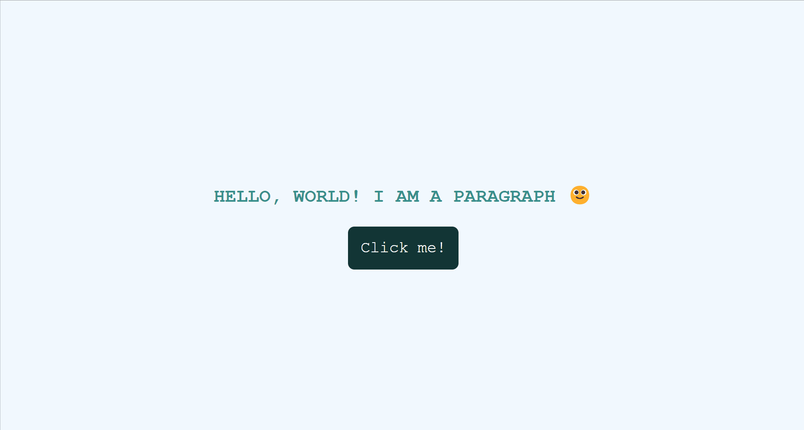

<h1>Quest React - base</h1>

This is a simple React exercise I've done for practicing, proposed as a challenge in the in the fullstack web development course Devquest by <a href="https://github.com/devemdobro">Dev em Dobro</a>.

<h2>Overview</h2>

<h3>The project</h3>

The challenge was to render on screen a paragraph with all the text in uppercase and some color using JS. Also, render a button that, upon click, shows an alert with a message about its label.

<h3>Preview</h3>
<h4>Desktop</h4>

<h3>Link</h3>
<ul>
    <li>Live site URL: <a href="https://julianastahelin.github.io/quest-react-base/">https://julianastahelin.github.io/quest-react-base/</a></li>
</ul>

<h2>My process</h2>

<h3>Built with 👩🏽‍💻</h3>
<ul>
    <li>React;</li>
    <li>Javascript;</li>
    <li>CSS 3.</li>
</ul>

<h3>What I practiced 💪🏽</h3>
<ul>
    <li>Building and rendering React components;</li>
    <li>Adding events to React components;</li>
    <li>Applying CSS to React components.</li>
</ul>